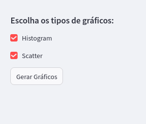
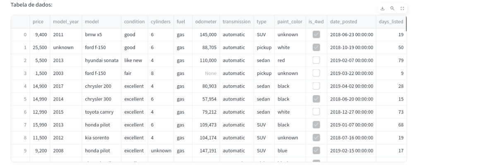
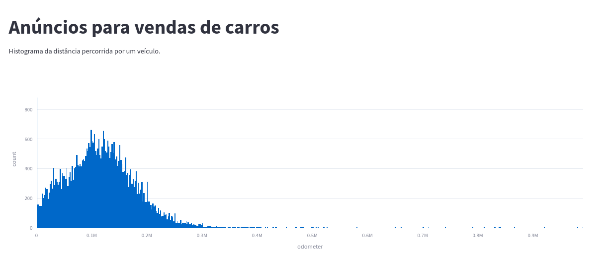

# Trabalho de Conclusão Sprint 5 - TriploTen

## Repositório: render_streamlit

Este repositório contém o trabalho prático da Sprint 5, cujo objetivo é criar um aplicativo web. A ênfase está nos passos necessários para implementar e distribuir o aplicativo, sem explorar exaustivamente os dados ou criar uma interface excessivamente elaborada.

### Estrutura de Pastas do Projeto

```
.
├── app.py
├── assets
│   ├── grafico.png
│   ├── sidebar.png
│   ├── tabela.png
│   └── vehicles.csv
├── LICENSE
├── notebooks
│   └── EDA.ipynb
├── README.md
├── requirements.txt
└── streamlit
    └── config.toml
```

### Resumo das Principais Funções

- **Leitura de Dados:** O aplicativo lê um arquivo CSV com as seguintes colunas:
    - `price`
    - `model_year`
    - `model`
    - `condition`
    - `cylinders`
    - `fuel`
    - `odometer`
    - `transmission`
    - `type`
    - `paint_color`
    - `is_4wd`
    - `date_posted`
    - `days_listed`

- **Análise Exploratória de Dados (EDA):** Um pequeno trabalho de EDA foi realizado no arquivo `./notebooks/EDA.ipynb`.

- **Interface Web:** A aplicação oferece uma interface web para testes, onde é possível selecionar gráficos para exibição e visualizar uma tabela com os dados de origem.

### Imagens da Interface Web

**Sidebar**



**Tabela**



**Gráfico**



### Link para Teste da Aplicação

[Clique aqui e confira!](https://www.google.com.br)
